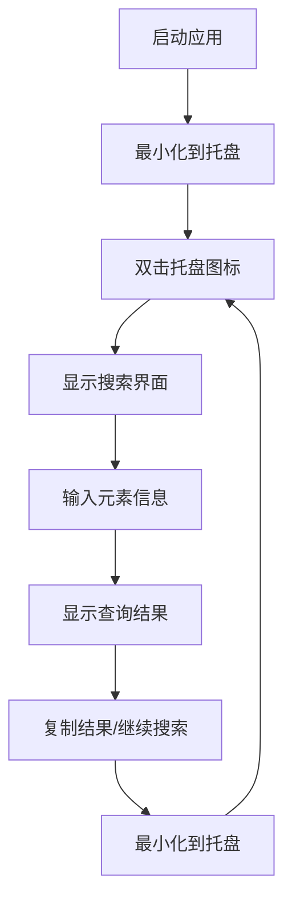

# 元素周期表查询应用产品需求文档

## 1. 产品概述

元素周期表查询应用是一款轻量级桌面工具，专为化学学习者和专业人士设计，提供快速便捷的元素信息双向查询功能。
- 支持中英文元素名称、符号的双向查询，帮助用户快速获取元素信息
- 采用系统托盘设计，不占用桌面空间，随时可用

## 2. 核心功能

### 2.1 用户角色
本应用面向所有用户，无需注册登录，开箱即用。

### 2.2 功能模块

我们的元素周期表查询应用包含以下主要页面：
1. **搜索界面**：搜索输入框、结果显示区域、快捷操作按钮
2. **托盘菜单**：显示/隐藏、退出应用选项
3. **设置界面**：应用偏好设置、快捷键配置

### 2.3 页面详情

| 页面名称 | 模块名称 | 功能描述 |
|----------|----------|----------|
| 搜索界面 | 搜索输入框 | 支持中文名称、英文名称、元素符号的输入，实时搜索提示 |
| 搜索界面 | 结果显示区域 | 显示元素的中文名、英文名、符号、原子序数、原子量等基本信息 |
| 搜索界面 | 快捷操作 | 复制结果、清空输入、最小化到托盘 |
| 托盘菜单 | 系统托盘图标 | 显示应用状态，双击激活搜索界面，右键显示菜单 |
| 托盘菜单 | 上下文菜单 | 显示/隐藏主界面、退出应用 |
| 设置界面 | 偏好设置 | 启动时最小化、搜索结果显示选项、界面主题 |
| 设置界面 | 快捷键配置 | 全局快捷键设置、搜索快捷键自定义 |

## 3. 核心流程

用户启动应用后，程序自动最小化到系统托盘。用户双击托盘图标或使用快捷键激活搜索界面，在输入框中输入元素信息（中文名、英文名或符号），系统实时显示匹配结果。用户可以复制结果或继续搜索其他元素。

## 4. 用户界面设计

### 4.1 设计风格

- **主色调**：深蓝色 (#2C3E50) 和浅灰色 (#ECF0F1)
- **辅助色**：绿色 (#27AE60) 用于成功状态，橙色 (#F39C12) 用于警告
- **按钮样式**：圆角矩形，轻微阴影效果
- **字体**：微软雅黑 14px（中文），Segoe UI 14px（英文）
- **布局风格**：简洁的卡片式设计，顶部搜索栏布局
- **图标风格**：扁平化设计，使用化学元素相关的图标

### 4.2 页面设计概览

| 页面名称 | 模块名称 | UI元素 |
|----------|----------|--------|
| 搜索界面 | 搜索输入框 | 居中布局，圆角边框，占位符文本"输入元素名称或符号"，实时搜索图标 |
| 搜索界面 | 结果显示区域 | 卡片式布局，元素符号大字体显示，中英文名称并列，原子信息小字体 |
| 搜索界面 | 操作按钮 | 底部水平排列，复制、清空、设置按钮，图标+文字组合 |
| 托盘图标 | 系统托盘 | 化学烧杯图标，16x16像素，支持高DPI显示 |
| 设置界面 | 设置面板 | 垂直布局，分组显示，开关按钮和下拉选择框 |

### 4.3 响应式设计

应用采用桌面优先设计，支持Windows系统的DPI缩放，界面元素根据系统设置自动调整大小，确保在不同分辨率下的清晰显示。