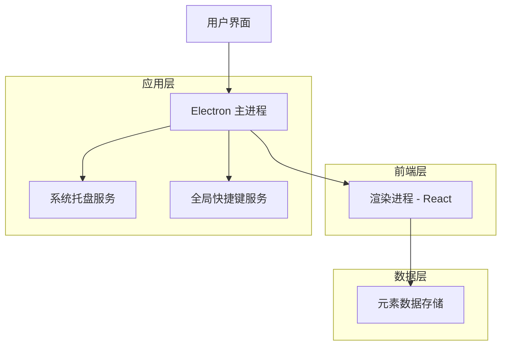
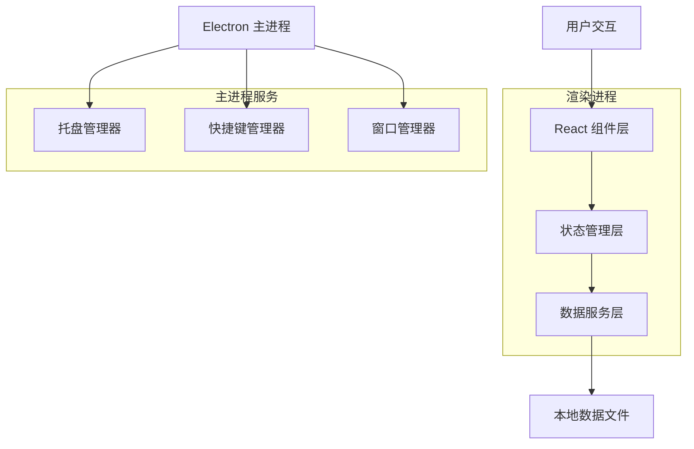
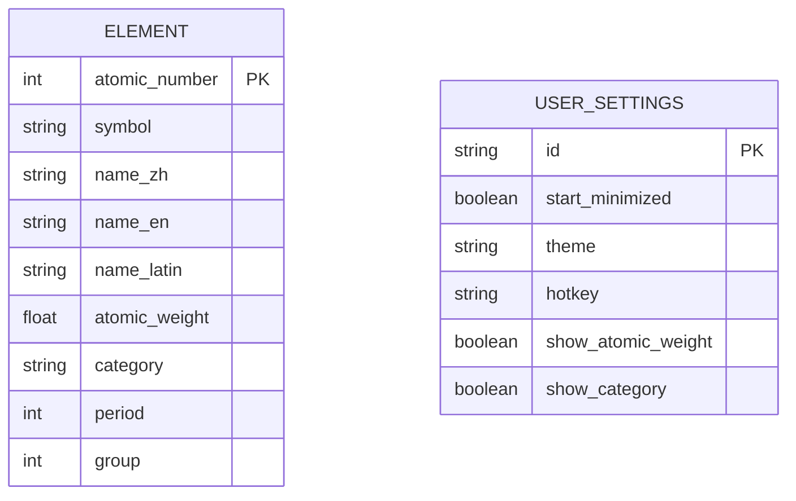

# 元素周期表查询应用技术架构文档

## 1. 架构设计



## 2. 技术描述

- 前端：React@18 + TypeScript + Tailwind CSS
- 桌面框架：Electron@latest
- 构建工具：Vite
- 数据存储：本地JSON文件

## 3. 路由定义

| 路由 | 用途 |
|------|------|
| / | 主搜索界面，显示搜索框和结果 |
| /settings | 设置页面，配置应用偏好和快捷键 |

## 4. API定义

### 4.1 核心API

元素查询相关
```
GET /api/elements/search
```

请求参数：
| 参数名称 | 参数类型 | 是否必需 | 描述 |
|----------|----------|----------|------|
| query | string | true | 搜索关键词（中文名、英文名或符号） |
| exact | boolean | false | 是否精确匹配 |

响应参数：
| 参数名称 | 参数类型 | 描述 |
|----------|----------|------|
| elements | Element[] | 匹配的元素列表 |
| total | number | 匹配结果总数 |

请求示例：
```json
{
  "query": "铁",
  "exact": false
}
```

响应示例：
```json
{
  "elements": [
    {
      "symbol": "Fe",
      "name_zh": "铁",
      "name_en": "Iron",
      "name_latin": "Ferrum",
      "atomic_number": 26,
      "atomic_weight": 55.845
    }
  ],
  "total": 1
}
```

## 5. 服务架构图



## 6. 数据模型

### 6.1 数据模型定义



### 6.2 数据定义语言

元素表 (elements.json)
```json
[
  {
    "atomic_number": 1,
    "symbol": "H",
    "name_zh": "氢",
    "name_en": "Hydrogen",
    "name_latin": "Hydrogenium",
    "atomic_weight": 1.008,
    "category": "非金属",
    "period": 1,
    "group": 1
  },
  {
    "atomic_number": 26,
    "symbol": "Fe",
    "name_zh": "铁",
    "name_en": "Iron",
    "name_latin": "Ferrum",
    "atomic_weight": 55.845,
    "category": "过渡金属",
    "period": 4,
    "group": 8
  }
]
```

用户设置 (settings.json)
```json
{
  "start_minimized": true,
  "theme": "light",
  "hotkey": "Ctrl+Shift+E",
  "show_atomic_weight": true,
  "show_category": true,
  "window_size": {
    "width": 400,
    "height": 300
  }
}
```